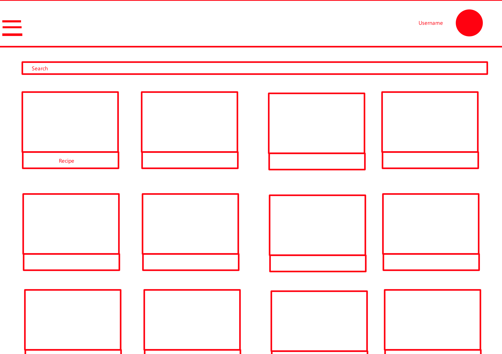
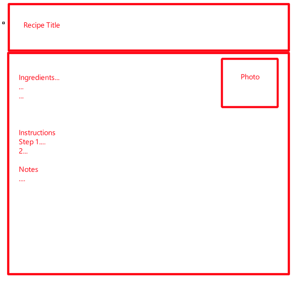
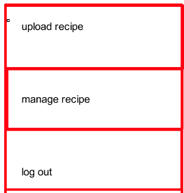

# Recipe Management Suite
### IT&C 350 database design project
Winter 2025

Tate McCauley
Jaren McLaughlin
Nathan Seneca
Ben Gutierrez

## Table of Contents
Project Overview	3
Project objective Statement	3
Project Stakeholders	3
App Requirements	4
Functional Requirements	4
User Management	4
Recipe Management	4
non-Functional Requirements	4
Security	4
Performance (These are arbitrary for now)	4
Scalability	5
Usability	5
Database Requirements	6
ER Diagram Images	6
Schema Diagram	6
Business Rules	6
Database Documentation	7
API Documentation	8
Front-End Documentation	9
Appendix 1: Low-fidelity paper prototypes	10
Appendix 2: High-Fidelity Paper Prototypes	14

## Project Overview
### Project objective Statement
Create a web-based system that allows users to store, organize, and easily manage their personal recipes with a standardized format and simple interface.

### Project Stakeholders
Primary: Amateur cooks
Secondary: Home users seeking recipe organization
Technical: Development team, system administrators

### App Requirements
Functional Requirements
User Management
Users can create new accounts
Users can log in/out securely
Users can manage their own account settings
Recipe Management
Users can create new recipes with:
Title
Ingredients (with amounts and units)
Step-by-step instructions
Optional notes
A standardized format for this data
Users can view their recipes in a list format
Users can edit existing recipes
Users can delete recipes
Users can search recipes by title
Users can view individual recipes in a clean, readable format

### non-Functional Requirements
Security
Secure password storage using hashing
password policy requiring 8 characters, 1 number, 1 capital, 1 special
JWT token-based authentication
Protection against SQL injection and XSS attacks
HTTPS encryption for all data transmission
Performance (These are arbitrary for now)
Page load times under 2 seconds
Recipe search results returned within 1 second
Support for multiple concurrent users
Efficient database queries for recipe retrieval
Scalability
Database design that can handle growth
Efficient storage of recipe data
Support for future feature additions
Usability
Responsive design for mobile and desktop
Intuitive navigation
Clear recipe display format
Simple recipe creation process

## Database Requirements
Tables: Users, Recipe, Ingredients

ER Diagram Images
[images]
Schema Diagram
[images]
Business Rules

### Database Documentation

## API Documentation
### Authentication:

POST /api/auth/register - Register new user

POST /api/auth/login - Login user

POST /api/auth/logout - Logout user

### Recipes:

GET /api/recipes - Get all user's recipes

GET /api/recipes/:id - Get specific recipe

POST /api/recipes - Create new recipe

PUT /api/recipes/:id - Update recipe

DELETE /api/recipes/:id - Delete recipe

GET /api/recipes/search?q=:query - Search recipes

## Front-End Documentation
Landing/Login Page

Login form
Register link
Basic app information

Recipe Dashboard

Search bar
Recipe list/grid view
Hamburger menu
Add recipe button

Recipe View Page

Recipe title
Ingredients list
Instructions list
Notes section
Edit button
Delete button

Recipe Creation/Edit Page

Title input
Dynamic ingredient input fields
Instruction input fields
Notes input
Save/Cancel buttons

### Appendix 1: Low-fidelity paper prototypes

## Appendix 2: High-Fidelity Paper Prototypes
[images]
